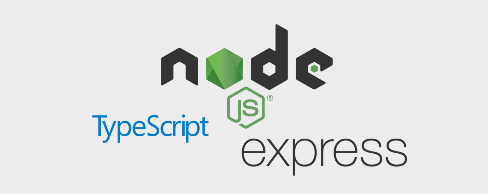

# smlpoints backend Node.js Server

<p align="center">
    
</p>

## Table of Contents
- [Recommended IDE Setup](#recommended-ide-setup)
- [About this project](#about-this-project)
- [Prerequisites](#prerequisites)

## Recommended IDE Setup
- [VSCode](https://code.visualstudio.com/) + [Eslint](https://marketplace.visualstudio.com/items?itemName=dbaeumer.vscode-eslint)

## About this project 
<p>The project includes the following packages:</p>

- [TypeScript](https://www.typescriptlang.org/) - TypeScript extends JavaScript by adding types.
- [ESLint](https://eslint.org/) - Find and fix problems in your JavaScript code
- [Express](https://expressjs.com/) - Fast, unopinionated, minimalist web framework for Node.js.
- [Axios](https://github.com/axios/axios) - Promise based HTTP client for the browser and node.js

## Prerequisites
<p>請先安裝好 Node.js 環境</p>

- [npm](https://www.npmjs.com/get-npm)
- [Node.js](https://nodejs.org/en/download/)

```
$ git clone https://github.com/andy922200/smlpoints-backend-nodejs.git
```

## Related Scripts

**1. Enter the project folder**
```
> Open a new terminal window and enter the folder
$ cd <project folder>
```
**2. Install packages via npm**
```
$ pnpm install
```
**3. For development**
```
$ pnpm dev // port:3000
```
**4. Fix the coding style automatically**
```
$ pnpm lint
```
**5. Build Project**
```
$ pnpm build
/* output dir is dist*/
```
**6. Deploy on the server**
```
$ npm run start
/* If your output dir is not 'dist', you should change this script.*/
```
## Author
- [Andy Lien](https://github.com/andy922200)
